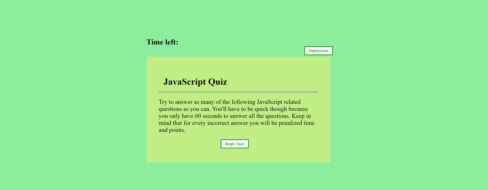

# JavaScript-Quiz

## Description

We were asked to make a Javascript quiz website with the following criteria:
* timed quiz
* time/point penalty for incorrect answers
* ability to enter name when complete
* ability view and clear highscores 

## Installation
* I started out by making the HTML page
* after that I used CSS to style to page
* when I had the HTML and CSS basics done I started on the JavaScript
* in the JavaScript file I started by creating variable to go with the classes and ids in HTML
* then I generated a variable to hold the questions and answers
* after that I set up a series of functions to start the quiz, generate questions, check answers, save highscore, show highscores, etc
* when that was all done I replaced the question placeholder with real questions and styled the page with CSS to make it look better

## Technologies Used
* JavaScript
* HTML
* CSS
* Git Bash
* GitHub

## Author
* Tyler Davis &nbsp; | &nbsp; [GitHub](https://github.com/Twdavis85)

## Review URL
[GitHub](https://github.com/Twdavis85/JavaScript-Quiz) &nbsp; | &nbsp; 
[Live](https://twdavis85.github.io/JavaScript-Quiz/)

